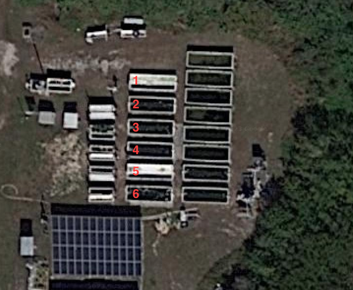

# Biomass Sensor Project

The goal of this project is to improve the measurement and prediction of algae density growing in outdoor tanks part of HBOI's IMTA system.

## Hardware

Custom sensors have been designed to automatically record alage density. The current sensor design is split into two main components.

The **sensor head** component is located underwater and is responsible for taking the actual algae density measurements.

The **topside** component is located above water and broadcasts the data collected by the sensor.

In addition to the deployed sensors, the project also utilizes a central basetation (RPI-3A) to collect and upload all of the data to Firebase.

The folders are broken down as follows:

* [biomass_ble](/biomass_ble/): code for the version 1 algae sensor (depreciated).
* [topside_box](/topside_box/): code for the topside component.
* [sensor_head](/sensor_head/): code for the sensor head component.
* [basestation](/basestation/): code for the esp32 radio receiver connected to the basestation.
* [pc_basestation](/pc_basestation/): code for the RPI basestation.

## Data

This repository contains a set of data collected by our version 1 algae sensor found in the [data folder](/data/). The code for processing the data is also found in the same folder with more information available [here](/data/README.md).

## Prediction

The prediction code is located in the [prediction folder](/prediction/).
